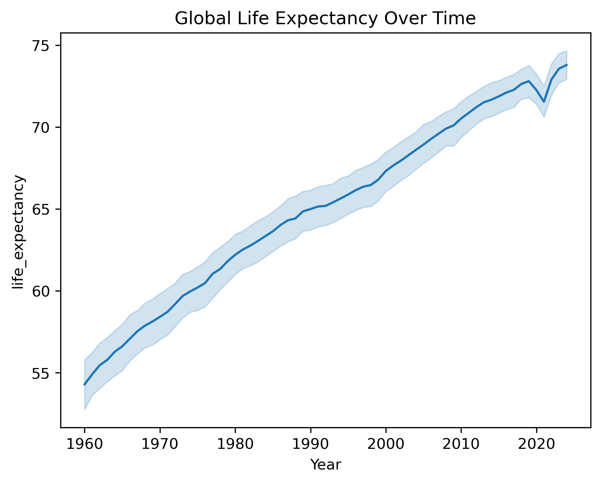

# Socioeconomic Determinants of Health Outcomes: A Data-Driven Analysis

## Overview
This project explores the relationship between socioeconomic indicators and global health outcomes using real-world World Bank data. The goal is to understand how factors such as GDP and education influence life expectancy across countries and over time.

## Data Source
The dataset is sourced from the World Bank API and includes:

- GDP (NY.GDP.MKTP.CD)
- Life Expectancy (SP.DYN.LE00.IN)
- Education / Literacy (SE.ADT.LITR.ZS)

Data was cleaned, merged, and structured for analysis.

## Methodology

1. Data extraction from World Bank API
2. Data cleaning and preprocessing
3. Merging multiple socioeconomic indicators
4. Exploratory Data Analysis (EDA)
5. Correlation analysis
6. Predictive modeling using Linear Regression

## Key Visualizations

### Life Expectancy Over Time

### GDP vs Life Expectancy

### Correlation Heatmap

## Key Insights

- Higher GDP is generally associated with higher life expectancy, but with diminishing returns.
- Education shows a strong positive correlation with improved health outcomes.
- Some countries exhibit stagnation despite economic growth, indicating structural inequalities.
- Predictive modeling shows that socioeconomic variables can partially explain variations in life expectancy.

## Tools Used
- Python
- Pandas
- Matplotlib
- Seaborn
- Scikit-learn
